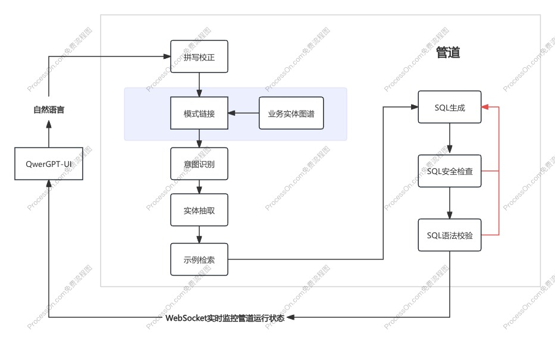
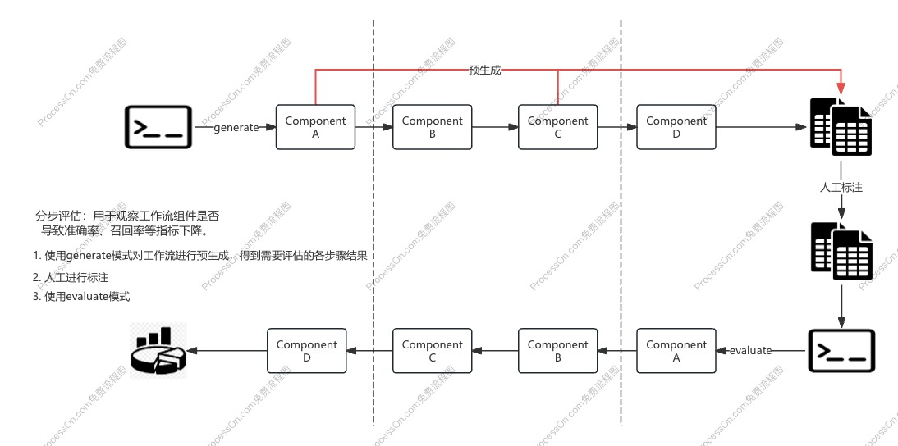

# Text-to-SQL

[QwerGPT](https://github.com/leopeng1995/qwergpt) 和 [QwerGPT-UI](https://github.com/leopeng1995/qwergpt-ui) 的示例项目，用于构建 Text-to-SQL 系统。

### 主要目标

1. 可观测性：工作流管道的实时观测
2. 易于评估：工作流管道的分步评估

### 前端效果


### Text-to-SQL 架构图



### 分步评估



- 使用管道 Pipeline 规范每个组件的输入输出结构，QwerGPT-UI 通过 Pipeline 提供的 REST 接口输入自然语言查询，通过 Pipeline 提供的 WebSocket 接口实时获取管道运行状态，支持暂停、恢复、终止工作流。
- 使用分步评估对工作流中的关键组件进行评估，计算评估指标（如准确率、召回率、F1值等），**分析哪个组件导致评估指标不达标，从而进行优化**。比方说，在测试数据集上，通过 generate 模式预生成了自然语言查询的意图识别结果，人工进行标注，通过调整 Prompt 或者优化逻辑，提高意图识别准确率，从而优化整个工作流的结果。这是为了避免误差累积，由于前面组件的错误导致后面组件的错误。

### Text-to-SQL 处理流程

#### 1. 拼写校正

用于解决用户输入的查询语句中可能存在的拼写错误。

- 通用大模型：使用通用大模型进行拼写校正，如 GPT-4o、Gemini-1.5-Pro 等。
- 专用大模型：使用针对拼写校正任务微调的大模型，如 [Chinese Text Correction Model](https://huggingface.co/shibing624/chinese-text-correction-7b)。

#### 2. 模式链接（可选）

当存在大量的数据表时，模式链接可以减少候选表的数量，提高检索效率。

根据 [The Death of Schema Linking? Text-to-SQL in the Age of Well-Reasoned Language Models](https://arxiv.org/pdf/2408.07702)，对于有足够上下文窗口的大模型来说（如 Gemini-1.5-Pro），模式链接带来的好处有限，反而可能因为错误地过滤掉必要列而降低 SQL 生成的准确率，因此，在 Text-to-SQL 中，模式链接是可选的。

过滤策略:

- 大模型过滤：使用提示词过滤
- 关键字过滤：使用关键字过滤，如 BM25 稀疏检索
- 实体图谱：把检索到的实体相关联的实体也检索出来

避免微调、低成本的方案：[SQL-to-Schema Enhances Schema Linking in Text-to-SQL](https://arxiv.org/pdf/2405.09593)。

#### 3. 意图识别

用于识别用户查询的意图，包括查询类型、查询模式和查询模板。

- 查询类型关注“如何查”（技术实现层面），帮助确定 SQL 结构
- 查询模式关注“查什么”（业务语义层面），帮助理解用户意图

查询类型：
- 单表查询：只涉及单个表的简单查询
- 多表关联查询：需要通过JOIN关联多个表
- 聚合查询：使用COUNT、SUM、AVG、MAX、MIN等聚合函数
- 复合查询：包含子查询或多个查询条件组合

查询模式：
- 统计模式：需要进行数据统计分析
- 筛选模式：需要使用WHERE条件进行数据筛选
- 时间查询模式：需要针对时间字段进行查询或过滤
- 排序模式：需要使用ORDER BY对结果进行排序
- 分组统计模式：需要使用GROUP BY进行分组统计

#### 4. 实体抽取

用于识别用户查询中的实体，包括业务实体和数据表实体。

**Note**: 这里面有个复杂点在于，用户查询中可能存在实体的缩写、同义词或近义词，通用大模型容易将公司全称和公司简称都识别成同一个字段。

#### 5. 示例检索

用于检索与用户查询最相似的示例，包括语义检索和关键字检索。

- 语义检索：使用 Embedding 模型生成示例数据集的向量索引，然后使用向量检索。
- 关键字检索：使用 BM25 稀疏检索。
- 查询模式和查询类型：使用查询模式和查询类型过滤示例。

#### 6. SQL生成

用于生成 SQL，包括使用 SQL 技术说明文档、数据表结构上下文、用户查询和相似的查询示例生成 SQL。

#### 7. SQL安全检查

用于检查 SQL 是否存在安全问题，包括检查 SQL 是否存在 SQL 注入、检查 SQL 是否存在敏感信息泄露等，如果存在问题，则将报错信息反馈，重新生成。

#### 8. SQL语法校验

用于检查 SQL 是否存在语法错误，包括检查 SQL 是否存在语法错误、检查 SQL 是否存在语法错误等，如果存在问题，则将报错信息反馈，重新生成。

### Quickstart

```bash
pip install -r requirements.txt
```

#### 启动 Backend

对应前端 `QwerGPT-UI` 的 `Backend` 服务，启动 `Backend` 服务后，前端 `QwerGPT-UI` 才能正常工作。

```bash
python server.py
```

#### 启动 Headless

不启动前端 `QwerGPT-UI`，有两种模式：generate 和 evaluate。

```bash
# 预生成中间步骤结果，用于人工标注
python headless.py --mode generate --concurrency 1
# 分步评估
python headless.py --mode evaluate --concurrency 1
```

### References

- [QwerGPT](https://github.com/leopeng1995/qwergpt) - A Lightweight Framework for building LLM applications.
- [QwerGPT-UI](https://github.com/leopeng1995/qwergpt-ui) - A Lightweight UI for QwerGPT.
